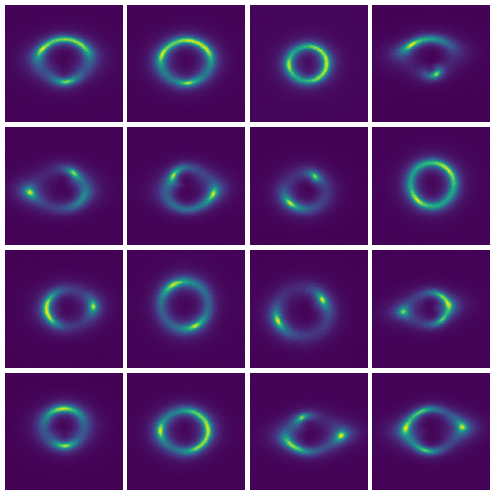
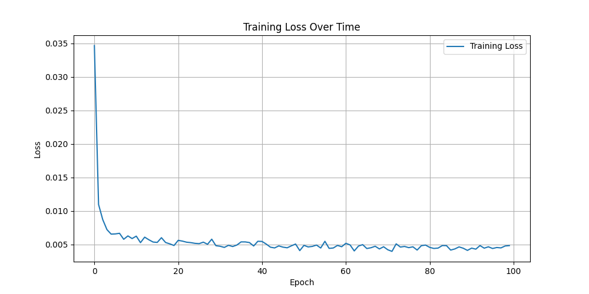

# Gravitational Lensing Image Generation with Diffusion Models  

## 📌 Overview  
This project trains a **Denoising Diffusion Probabilistic Model (DDPM)** to generate realistic **strong gravitational lensing images** (e.g., Einstein rings, arcs) from a dataset of **10,000 simulated lensing images**.  
The model is implemented in **PyTorch** and evaluated using **Fréchet Inception Distance (FID)**.  

## 🚀 Key Features  
- **U-Net Architecture** with residual blocks, time embeddings, and self-attention.  
- **Linear noise scheduling** with **1000 diffusion steps**.  
- **FID evaluation** for quantitative assessment of generated images.  
- **Training metrics:** Loss tracking, LR scheduling, and sample generation during training.  

## 📊 Results  

| **Metric**           | **Value**             |
|----------------------|----------------------|
| Final Loss          | 0.0048               |
| FID Score          | 34.36                |

## Generated Lensing Samples  
 

## Loss Curve
 

